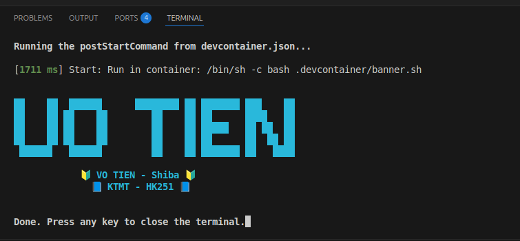
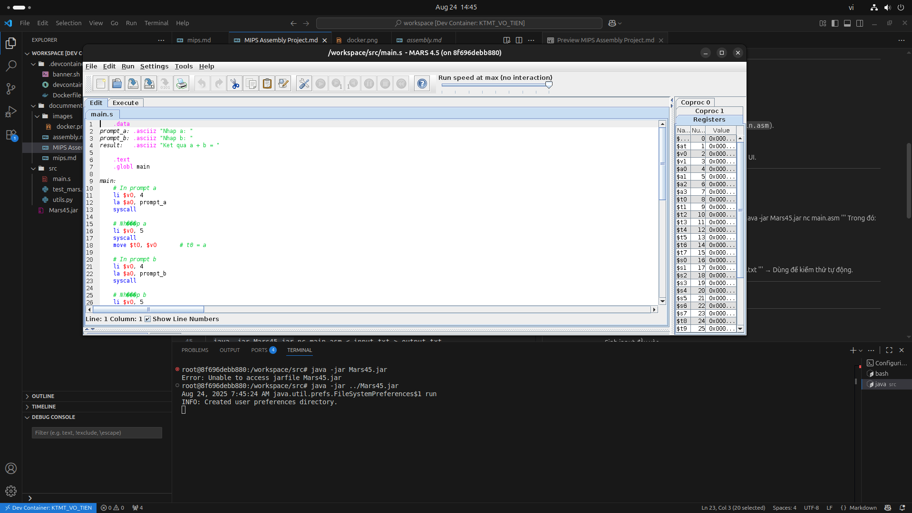
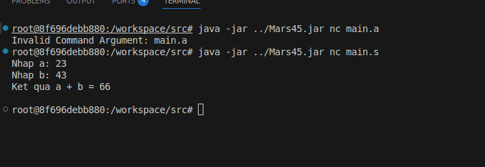
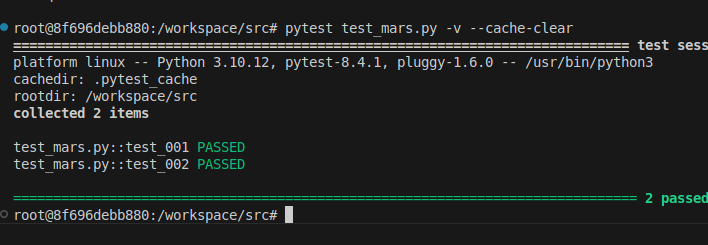

# README — MIPS Assembly Project

## 1. Chạy môi trường Dev Container (.devcontainer)
- Dự án hỗ trợ chạy trong **VS Code + Docker**.  
- Cài đặt:
  1. Cài **Docker** và **VS Code**.  
  2. Cài extension **Dev Containers** trong VS Code.  
  3. Mở project, chọn **"Reopen in Container"**.  
- Môi trường này sẽ tự cài sẵn **Java, Python, pytest** và các tool cần thiết để chạy MIPS.  

---

## 2. Chạy Mars45.jar
**MARS (MIPS Assembler and Runtime Simulator)** là công cụ phổ biến để viết và chạy MIPS Assembly.  

---

### 🔹 Cách 1: Chạy với giao diện UI
- Dùng để viết, chạy, và debug code MIPS trực quan.  
- Lệnh chạy:
  '''
  java -jar Mars45.jar
  '''
- Sau khi mở giao diện:
  1. Chọn **File → Open** → chọn file `.asm` (ví dụ `main.asm`).  
  2. Nhấn **Assemble** để biên dịch.  
  3. Nhấn **Run → Go** để chạy chương trình.  
- Có thể xem **thanh ghi, bộ nhớ, breakpoint** ngay trong UI.  

---

### 🔹 Cách 2: Chạy trực tiếp bằng Command Line
- Dùng để chạy nhanh hoặc tích hợp với **pytest**.  
- Ví dụ: chạy file `main.asm` và in kết quả ra console:
  '''
  java -jar Mars45.jar nc main.asm
  '''
  Trong đó:  
  - `n` = no GUI (không mở giao diện).  
  - `c` = chạy code ngay sau khi assemble.  

- Nếu cần truyền input từ file:  
  '''
  java -jar Mars45.jar nc main.asm < input.txt > output.txt
  '''
  → Dùng để kiểm thử tự động.  

---

## 3. Kiểm thử bằng Pytest
- Thư mục `tests/` chứa các file test Python.  
- Các test này có thể:
  - Sinh input đầu vào.  
  - Gọi code MIPS chạy bằng Mars.  
  - So sánh kết quả với output mong đợi.  

Cách chạy pytest: `pytest test_mars.py -v --cache-clear`

Nếu test pass:
- Kết quả hiển thị màu **green (PASSED)**.  
Nếu sai:
- Hiển thị **red (FAILED)** cùng thông tin lỗi.  

